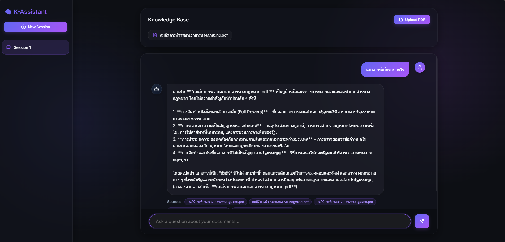

<div align="center">
  <h1>🧠 AI Knowledge Assistant (RAG)</h1>
  <p><strong>A Production-Ready, Completely Free-to-Operate RAG Application built with FastAPI, React, and Groq</strong></p>

  
  
  
  
  
</div>

<br/>

<div align="center">
  
</div>

## 📌 Overview

**AI Knowledge Assistant** is a powerful Retrieval-Augmented Generation (RAG) system similar to NotebookLM but optimized for zero operational cost. It allows users to upload PDF documents, intelligently chunks and embeds the text locally, and enables multi-turn, context-aware conversations using ultra-fast LLMs.

The system is designed with a **premium Glassmorphism UI** and a highly scalable, modular backend architecture.

## ✨ Key Features

- 💸 **$0 Inference Cost**: Uses **HuggingFace Sentence Transformers** for 100% local embedding generation and **Groq Free Tier** (`gpt-oss-120b`) for lightning-fast reasoning.
- 📚 **Document Intelligence**: Upload PDFs, extract text, and perform semantic search via `pgvector`.
- 🧠 **Agentic Reasoning**: ReAct-style agent capable of determining when to search the knowledge base versus answering generally. Provides **Citations** for every retrieved fact.
- 🎨 **Premium Frontend**: Built with React (Vite) utilizing Vanilla CSS for a beautiful, sleek dark mode with glassmorphism aesthetics.
- 💾 **Session Memory**: Full CRUD for chat sessions; seamlessly switch between different research contexts.

## 🏗 System Architecture

- 👤 **User** ➔ Uploads PDFs & chats via the web interface.
- 🎨 **Frontend (React + Vite)** ➔ Provides a responsive, premium glassmorphism UI.
- ⚙️ **Backend API (FastAPI)** ➔ The core engine routing requests to various services:
  - 📄 **Document Pipeline:** Extracts text using `PyMuPDF` ➔ Chunks text ➔ Generates $0-cost local embeddings via `Sentence-Transformers`.
  - 💾 **Vector Database (PostgreSQL + pgvector):** Stores chat history, documents, and vector embeddings for high-speed semantic search.
  - 🧠 **AI Agent Orchestrator:** Uses a ReAct reasoning loop. It intelligently decides when to query the database for facts and when to answer directly using the lightning-fast **Groq API (GPT-OSS-120B)**.

## 🛠 Tech Stack

| Component | Technology | Description |
|-----------|------------|-------------|
| **Frontend** | React, Vite, Lucide | Glassmorphism UI, Component-based architecture |
| **Backend** | FastAPI, Uvicorn | High-performance Python async REST API |
| **Database** | PostgreSQL, pgvector | Relational data and Vector similarity search |
| **ORM** | SQLAlchemy | Database abstraction layer |
| **LLM Engine** | Groq (`gpt-oss-120b`) | Extremely fast inference for the Agent |
| **Embeddings** | `all-MiniLM-L6-v2` | Fast, local text embeddings via HuggingFace |
| **PDF Parser** | PyMuPDF | Robust document text extraction |

---

## 🚀 Getting Started

There are two ways to run this project: **Full-Stack Docker (Recommended)** or **Local Development**.

### Prerequisites
- Docker Desktop
- A free [Groq API Key](https://console.groq.com/keys)
- *(Optional)* Python 3.11+ and Node.js 20+ for local development

### 1. Clone & Configure
```bash
git clone https://github.com/yourusername/rag-knowledge-assistant.git
cd rag-knowledge-assistant

# Setup environment variables
cp .env.example .env
```
👉 *Open `.env` and insert your `GROQ_API_KEY`.*

### Option A: Full-Stack Docker Deployment (Recommended)
This is the easiest way to run the entire stack (Database, Backend API, and Frontend via Nginx) with a single command.

```bash
docker-compose up -d --build
```
Once the containers are running:
- **Web Interface:** Visit [http://localhost](http://localhost)
- **API Documentation:** Visit [http://localhost:8000/docs](http://localhost:8000/docs)

---

### Option B: Local Development
If you want to modify the code and see changes in real-time.

**1. Start the Database**
```bash
docker-compose up -d db
```

**2. Run the Backend (FastAPI)**
```bash
python -m venv venv
source venv/bin/activate  # On Windows: venv\Scripts\activate
pip install -r requirements.txt
uvicorn app.main:app --reload
```

**3. Run the Frontend (React + Vite)**
Open a **new terminal tab**:
```bash
cd frontend
npm install
npm run dev
```
Visit [http://localhost:5173](http://localhost:5173) to start developing!

---

## 📁 Project Structure

```text
rag_chatbot/
├── app/
│   ├── api/            # FastAPI Routers (REST endpoints)
│   ├── agent/          # LLM Orchestrator & Tool definitions
│   ├── core/           # Config and Exceptions
│   ├── db/             # SQLAlchemy Models & Connection
│   ├── schemas/        # Pydantic validation models
│   └── services/       # Core business logic (RAG, Chat, Docs)
├── frontend/           # React UI Application
│   ├── src/components/ # Reusable UI pieces (Sidebar, Chat, etc.)
│   ├── src/services/   # API communication wrappers
│   └── src/index.css   # Premium Design System variables
├── docker-compose.yml  # Database setup script
├── requirements.txt    # Python dependencies
└── .env                # Environment variables
```

## 👨‍💻 Author
**Chanatip Chaikij (นาย ชนาธิป ชัยกิจ)**
- GitHub: [Your GitHub Profile](https://github.com/yourusername)

## 📜 License
This project is open-source and available under the MIT License.
